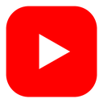
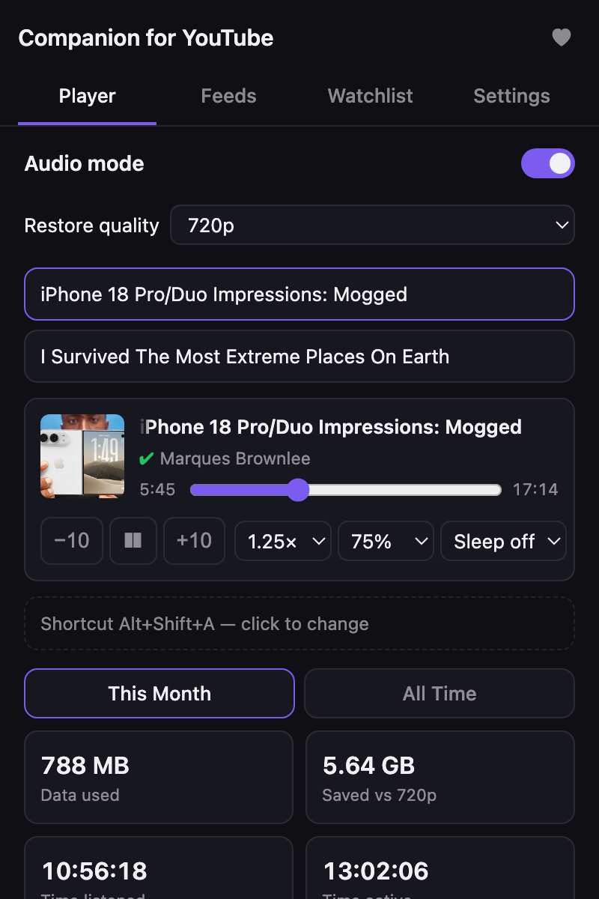
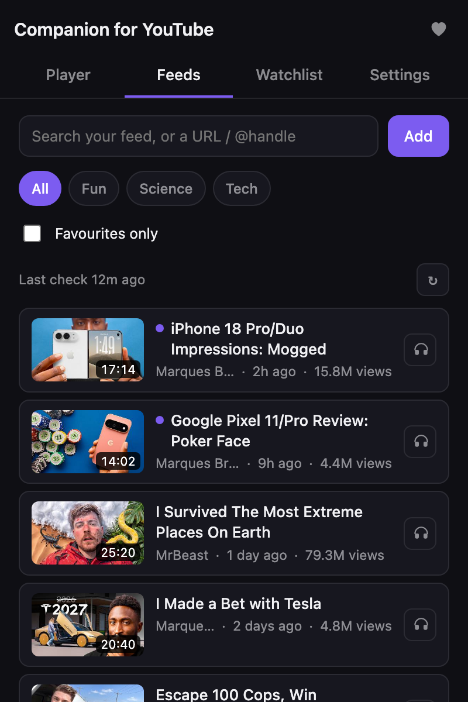
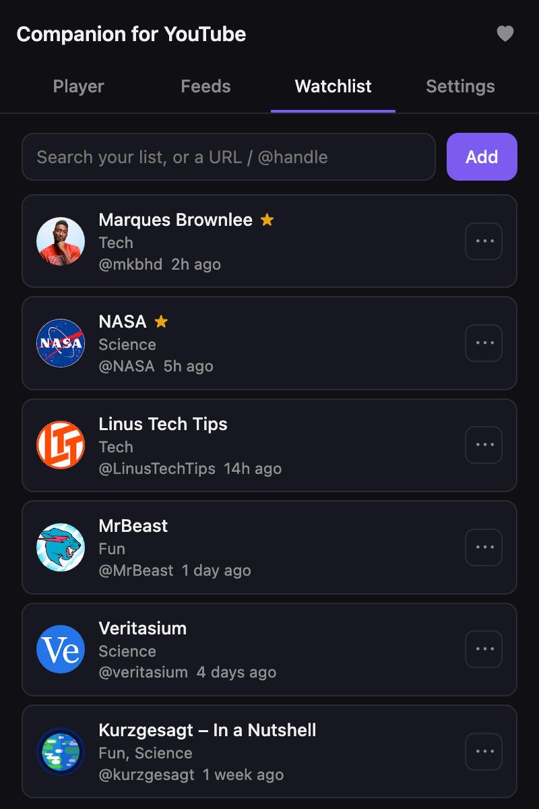
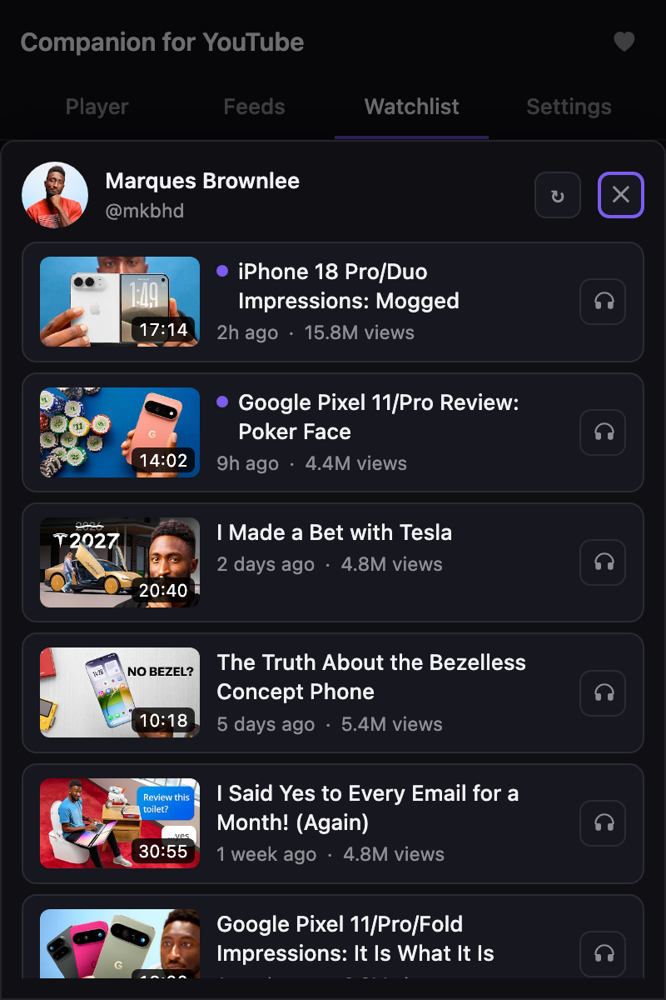
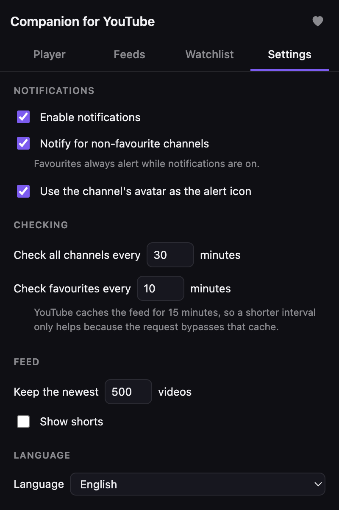
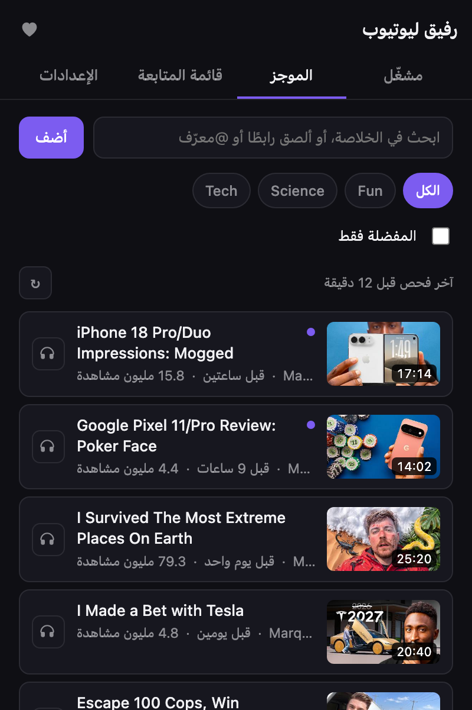

<p align="center">
  
</p>

<h1 align="center">Companion for YouTube</h1>

<p align="center">
  Follow YouTube channels without a Google account.<br />
  One merged feed, alerts on new uploads, and an audio-only mode that saves data.
</p>

<p align="center">
  <a href="https://chromewebstore.google.com/detail/hpajekcplhidhjidohfmebpeianbhcgd"></a>
  <a href="https://microsoftedge.microsoft.com/addons/detail/companion-for-youtube/neaandgimpffglakmlbmmkmmmlahibfh"></a>
  
  
  
  
  
</p>

<table align="center">
  <tr>
    <td align="center"><br /><sub>Player</sub></td>
    <td align="center"><br /><sub>Feeds</sub></td>
    <td align="center"><br /><sub>Watchlist</sub></td>
  </tr>
  <tr>
    <td align="center"><br /><sub>Channel sheet</sub></td>
    <td align="center"><br /><sub>Settings</sub></td>
    <td align="center"><br /><sub>Arabic, right to left</sub></td>
  </tr>
</table>

## What it does

- On first install, a welcome page helps you bring your channels, try audio
  mode, and pin the icon. *(coming in 2.0)*

**Audio**
- Turn on audio mode for a YouTube tab. The video drops to 144p and a cover
  goes over it. You keep the sound and use about 8× less data than 720p.
  In Settings you can pick that cover from a picture on your device; it is
  not a web address and is not in backups.
- Turn it off and the video goes back to the quality you were watching.
- Control playback from the popup: seek, back and forward 10 seconds, play
  and pause, speed, and volume.
- A ✔ before the channel name in the player means you follow it.
  *(coming in 2.0)*
- Sleep timer: pause after 15, 30 or 60 minutes. It keeps counting after the
  popup closes. *(coming in 2.0)*
- With more than one YouTube tab open, pick which one to control.
- See how much data you used and saved, and how long you listened, this
  month or all time.
- Keyboard shortcut: <kbd>Alt</kbd>+<kbd>Shift</kbd>+<kbd>A</kbd> turns audio
  mode on or off (change it at `chrome://extensions/shortcuts`).
- <kbd>Alt</kbd>+<kbd>Shift</kbd>+<kbd>Y</kbd> opens the popup, and Settings
  shows both keys with a button to change them. *(coming in 2.0)*

**Feeds**
- Every video from your channels in one list, newest first.
- Live streams and premieres are tagged. Shorts are hidden unless you turn
  them on.
- Type to filter by title or channel. Tick **Favourites only** to narrow it
  down.

**Watchlist**
- Add a channel by pasting its URL or `@handle`, or press **Add** with an
  empty box to add the channel of the tab you are on.
- Bring all your YouTube subscriptions at once: download `subscriptions.csv`
  from Google Takeout and pick it in the extension. No sign-in, and the file
  stays on your device. *(coming in 2.0)*
- On a YouTube channel or video you don't follow yet, the Player tab shows
  that channel with a **Follow** button. A video made by several channels
  lists each one, with a ✔ on those you already follow. *(coming in 2.0)*
- Star your favourites. They sit at the top and are checked more often.
- Mute one channel's alerts from its ⋯ menu. Its videos still show in Feeds.
  *(coming in 2.0)*
- Click a channel to see its latest videos without leaving the popup.
- If a channel's last check failed, it says why and offers **Retry**.
  *(coming in 2.0)*

**Alerts**
- A desktop notification when a channel uploads. One alert per channel, even
  if it posted several videos.
- The toolbar badge counts new videos since you last opened the popup.

**Settings**
- How often to check, how many videos to keep, and which alerts you want.
- The look of the audio mode cover: six colour presets, your own colour, or
  an image.
- English or Arabic, with a full right-to-left layout.
- Export your channels and settings to a file, and import them back (merge or
  replace).
- **Clear watchlist** removes every channel at once, after asking.
  *(coming in 2.0)*

## Install

**Chrome:** get it from the
[Chrome Web Store](https://chromewebstore.google.com/detail/hpajekcplhidhjidohfmebpeianbhcgd).

**Edge:** get it from
[Edge Add-ons](https://microsoftedge.microsoft.com/addons/detail/companion-for-youtube/neaandgimpffglakmlbmmkmmmlahibfh).

The project site is [ashahinl.github.io/Youtube-Companion](https://ashahinl.github.io/Youtube-Companion/).

**From source**, which can be newer than the store version:

1. Download this repo (**Code → Download ZIP**) and unzip it, or clone it.
2. Open `chrome://extensions` (or `edge://extensions`).
3. Turn on **Developer mode**.
4. Click **Load unpacked** and pick the folder that holds `manifest.json`.
5. Pin the icon to your toolbar.

There is no build step. The folder is the extension.

## Privacy

- No sign-in, no Google account, no API key.
- Channel and video data comes only from public `www.youtube.com` endpoints
  that anyone can open. Those requests go out without your YouTube cookies.
- Thumbnails and channel pictures load from YouTube's own image servers.
- Your channels, feed, settings and stats stay in your browser's extension
  storage. Nothing is sent anywhere else. There are no analytics.
- Removing the extension opens a short page on GitHub Pages that asks why.
  It sends nothing unless you post your answers as a GitHub issue.
  *(coming in 2.0)*

The full policy is in [PRIVACY.md](PRIVACY.md). To report a security
problem, see [SECURITY.md](SECURITY.md).

### Permissions

| Permission | Why |
|---|---|
| `storage` | Keep your channels, feed, settings and stats. |
| `alarms` | Check your channels on a schedule. |
| `notifications` | Tell you about new uploads. |
| `activeTab` | Add the channel of the tab you are on, when you press Add. |
| `declarativeNetRequestWithHostAccess` | YouTube rejects requests that come from an extension address. One rule sets the origin and referrer of this extension's own `youtube.com` requests, and touches no other request. |
| `https://www.youtube.com/*` | Read public channel data, and run audio mode on YouTube pages. |

## Development

Plain JavaScript modules. No dependencies, nothing to install.

```bash
npm test        # run every test suite
npm run check   # manifest is valid, every file parses, popup links resolve
npm run pack    # build the store zip into dist/
npm run shots   # re-render docs/screenshots and store/images
node scripts/draw-icon.js   # redraw icons/ after changing its geometry
```

`npm test` and `npm run check` must both pass before a change counts as
done. Tests run on saved YouTube responses in `test/fixtures/` and never
touch the network. `npm run shots` needs Chrome or Edge installed (or
`CHROME_PATH`) and loads thumbnails from YouTube.

```
src/
  background/   service worker: scheduled checks, alerts, badge
  content/      audio mode on youtube.com pages
  lib/          YouTube parsing, storage, settings, backup, Takeout import, i18n
  popup/        the popup: Audio, Feeds, Watchlist, Settings
  welcome/      the page opened on install
_locales/       English and Arabic strings
docs/           screenshots, and what YouTube serves (measured)
scripts/        packaging, screenshots, and the icon drawn from geometry
site/           the uninstall page, published to GitHub Pages
store/          store listing copy and images
test/           test suites and fixtures
```

Release notes are in [CHANGELOG.md](CHANGELOG.md). How a version ships is in
[RELEASING.md](RELEASING.md).

## Bugs and ideas

[Open an issue](https://github.com/ashahinL/Youtube-Companion/issues). This
repository does not take pull requests; say what you need in the issue
instead. Security problems go through [SECURITY.md](SECURITY.md), not a
public issue.

## Support

Companion for YouTube is free, with no ads and no tracking. If it saves you
time or data, you can chip in — the heart in the popup's top bar shows the
same options.

- **PayPal:** [paypal.me/ashahin22](https://paypal.me/ashahin22)
- **InstaPay** (Egypt): `ashahin22@instapay`

## Licence

[MIT](LICENSE). Do what you like with it; keep the copyright notice.

Companion for YouTube is not affiliated with, endorsed by or sponsored by
YouTube or Google. YouTube is a trademark of Google LLC.
